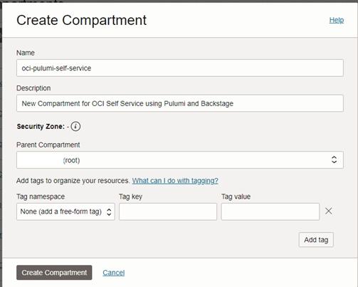
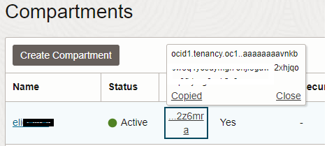
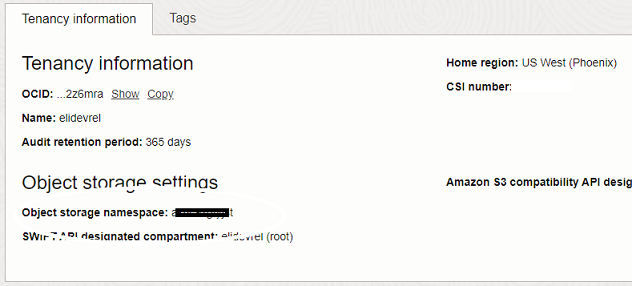
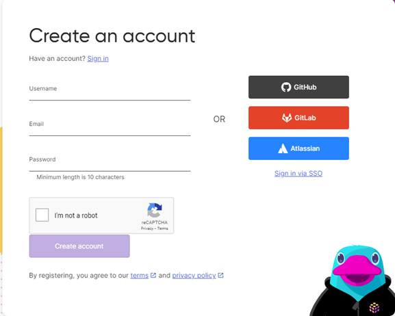
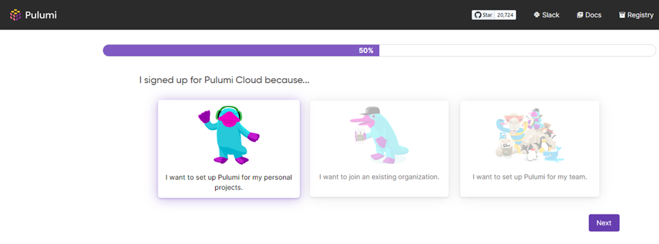
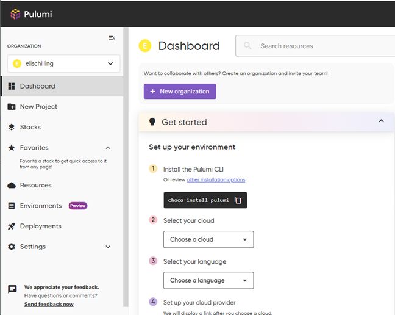

# Prepare your tenancy

## Introduction

For this workshop you'll make use of the OCI Console, Cloud Shell, and the Pulumi app service. Here, we'll walk through all the tasks necessary to set up and obtain resources that will be used throughout the workshop. 

Estimated time: 15 minutes

### Objectives

* Sign into your OCI tenancy
* Create new Compartment
* Create an API Signing Key
* Sign up for a free Pulumi account

## Task 1: Create a new compartment for the workshop

1. Navigate to **`Identity and Security`** -> **`Compartments`**.

2. Click **`[Create Compartment]`**, then provide a **Name** and **Description**. **Parent Compartment** should be *(root)*.

    

3. Click **[`Create Compartment`]** to provision the resource.

4. Once the Compartment in task 2 has been created, it will appear in the list of compartments.

5. Locate the **OCID** column for the compartment you just created. Hover over the partially displayed OCID and click the *Copy* link.  Store the value in a text file for later use.

    

## Task 2: Create an API key

1. Click the profile avatar in the top right corner of the console and select **My profile**

    

2. Scroll down to the **Resources** Menu on the left side and view the available options. This is where you would create API Keys (for CLI, Terraform, SDK access) and Auth Tokens (i.e. access to OCI Container Registry).

3. Click **API keys**

4. Click **`[Add API key]`** and then click **`[Download private key]`**. 

5. Make note of where the file was saved, you will need to retrieve the contents in a later step. Click **`[Add]`** to safe the key and close the dialog box.

    >Note: If you do not download the key before clicking the Add button, you will not be able to go back and retrieve the key.

## Task 3: Retrieve the Object storage namespace for your tenancy

1. Click the profile avatar in the top right corner once again and select **Tenancy: <your tenancy name>**

2. Locate the **Object storage namespace** item and copy the value. Store this 12-digit string in a safe place...you'll need it later.

    

## Task 4: Sign up for a free Pulumi account

1. Navigate to https://www.pulumi.com

2. Click **Sign In** in the top right corner.

3. Under the **Sign In** banner, click <ins>Create an account</ins>. Fill in your desired usernam, email address, and password. Complete the Captcha, then click **[`Create account]`**.

    

4. On the next page, you'll be prompted for why you signed up. Click "I want to set up Pulumi for my personal projects" and click **`[Next]`**.

    

5. Welcome to the Pulumi dashboard! If it doesn't automatically take you here, click Next again.

    

6. You can minimze the Pulumi dashboard for now. We'll come back to it in a future lab.

You may now **proceed to the next lab**.

## Acknowledgements

* **Author** - Eli Schilling - Technical Architect
* **Contributors** -
* **Last Updated By/Date** - August, 2024