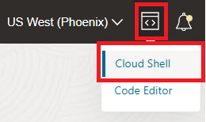
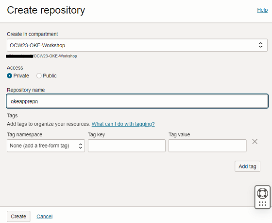

# Start your first Pulumi stack and deploy infrastructure

## Introduction

In this lab you will create your first Pulumi stack from a pre-built YAML template. The stack will deploy the open source project Backstage on [OCI Container Instances](https://www.oracle.com/cloud/cloud-native/container-instances/).

Estimated time: 20 minutes

### Objectives

* Set up and run your first Pulumi stack
* Access the Backstage portal
* Create a new environment in Pulumi

## Task 1: Set up Pulumi in Cloud Shell

1. Open Cloud Shell

    

2. Create a new directory in which to complete the workshop tasks.

    ```bash
    <copy>mkdir pulumi && cd pulumi</copy>
    ```

3. Clone the source code repository.

    ```bash
    <copy>git clone todo:add_url && cd oci-pulumi-resources/00-backstage</copy>
    ```

4. Create a new virtual environment with Python. This will allow the flexibility to install the requisite Pulumi binaries.

    ```bash
    <copy>
    python -m venv venv/
    source venv/bin/activate
    </copy>
    ```

    The the shell prompt should now have the prefix `(venv)`. To exit the virtual environment, type `deactivate` and press enter.

    >Note: If you exit or restarte Cloud Shell, you will need to return to the workshop folder and issue the source command again.


    

## Task 3: Get to know your OKE cluster

Now that Kubernetes is up and running, interacting with the cluster is pretty much the same as if you were running Kubernetes on your own equipment. Let's take a look at some of the resources that get created as part of the initial setup.

1. First and foremost, what do we know about our new OKE cluster? Type `kubectl cluster-info` to find out!

2. Take a look at the default set of namespaces with `kubectl get namespaces`. You should see *default*, *kube-node-lease*, *kube-public*, and *kube-system*.

3. Check to see which pods are running across all namespaces with `kubectl get pods -o wide -A`. You should see the likes of coredns, flannel, kube-proxy, and more.

4. Are there any ingress resources defined? Try `kubectl get ingress -A` - the results should be empty as we've not yet deployed an ingress controller or defined any ingress resources.  

5. Minimize (but do not exit) Cloud Shell.

## Task 4: Create a Container Registry Repo

The OCI Container Registry (OCIR) is a secure, Dockerhub-compliant service that enables you to store and manage your container iamges securely, within the confines of OCI. 

<details><summary><b>Prefer to work with the CLI?</b></summary>

The instructions below will take you through creating a new repo via the Web UI. If you'd prefer to create the repo using the OCI CLI, you may remain in Cloud Shell and run this command (make sure to adjust the parameter value to reflect your own compartment OCID).

    ```bash
    <copy>
	oci artifacts container repository create --compartment-id ocid1.compartment.oc1..aaaaaaaace...... --display-name okeapprepo
    </copy>
    ```

---
</details>

1. Navigate to **`Developer Services`** -> **`Container Registry`**

2. Click **Create repository**

3. Provide a name for your repo and ensure it is set to **Private** access.

    

4. Click **`[Create]`**

## Task 5: Register a secret in Kubernetes

1. First things first - you'll need to locate the region key for your selected region. This will be used to connect to the apprpriate Container Registry Endpoint. Return to Cloud Shell and enter the following command:

    ```bash
    <copy>
    oci iam region list --query 'data[?name == `us-phoenix-1`].key'
    </copy>
    ```

    >NOTE: if not using Phoenix, replace the region name with that which you've selected for the workshop.

2. Your Container Register endpoint will thus be the **key** plus `.ocir.io`. *i.e.* `phx.ocir.io`

3. For this next command you'll need to retrieve your Auth token which was created in the first lab. Construct the following command, making sure to input your own details:

    ```bash
    <copy>
    kubectl create secret docker-registry ocirsecret --docker-server='container registry endpoint' --docker-username='complete username' --docker-password='auth token' --docker-email='your email address'
    </copy>
    ```
    
    * container registry endpoint = i.e. phx.ocir.io
    * complete username = `<tenancy namespace>/<username or email address>`
        *i.e. abc123dev456/eli.schilling@oracle.com*
    * auth token = the value of the token created in lab 1

4. Validate that the secret was created successfully:

    ```
    <copy>
    kubectl get secrets
    <copy>
    ```

    ```
    user123@cloudshell:~ (us-phoenix-1)$ kubectl get secrets
    NAME         TYPE                             DATA   AGE
    ocirsecret   kubernetes.io/dockerconfigjson   1       3m
    ```


You may now **proceed to the next lab**.

## Learn More

* [Oracle Container Engine for Kubernetes (OKE)](https://www.oracle.com/cloud/cloud-native/container-engine-kubernetes/)


## Acknowledgements

* **Author** - 
* **Contributors** -
* **Last Updated By/Date** -