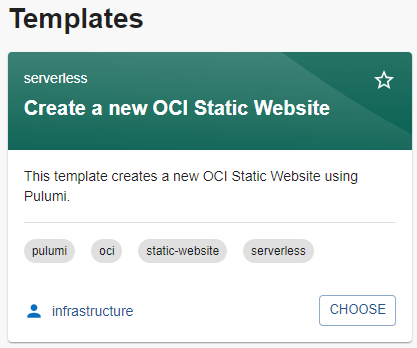

# Create your first Backstage infrastructure template

## Introduction

In this lab you'll deploy your first template to Backstage. The provided template will be used to create a simple static web page using OCI Object Storage that serves an index.html file. The index.html file will be populated with the input provided by the userin the Backstage app.

Estimated time: 20 minutes

### Objectives

* Create a new backstage template
* Use the template to provision a static web page in OCI Object Storage

## Task 1: Create the Backstage template.

1. From the Backstage dashboard, click the **`[CREATE]`** button.

2. You'll see there is an existing template for `Create a new OCI Static Website`.

    

3. Click **`[Choose]`** to select this template, then fill in the fields on the subsequent screen.

    * **Name** - a new, unique Pulumi stack name
    * **Description** - A brief summary; something like, "OCI Pulumi Workshop - First Template"
    * **Owner** - Enter a team name, such as `Development` or `Infrastructure`
    * **Compartment OCID** - Enter the OCID of the compartment that you created earlier for the workshop.

    >Note: We've not added any entities to the platform yet so Owner name isn't important just yet.

4. Click **`[NEXT]`** and fill in the Pulumi template details.

    * **Organization** - Enter somethign like, "Workshop"
    * **Pulumi ESC** - **`oci-pulumi-self-service`**
    * **Select stack** - Pick one [Development | QA | Production]
    * **Website content** - Copy and paste the following: 

        ```
        <copy>
        <html>
        <head>
        <title>OCI + Pulumi + Backstage = Self Service Portal</title>
        <h1>Well done - your first template deployment!</h1>
        </head>
        </html>
        </copy>
        ```

5.  Click **`[NEXT]`** and fill in the Repository Location (where Backstage will store your output code).

    * **Host** - Github is the only option for now. You can of course update the template later to support other options.
    * **Owner** - Your Github user ID; must be the same one you used to generate the PAT at the beginning of the workshop.
    * **Repository** - Pick a name for the new repo that Backstage will create.

6. Click **`[REVIEW]`**, make sure the details look good, then click **`[CREATE]`**. Watch the magic happen.

## Task 2: Interact with the Backstage component


## Task 3: Explore the Pulumi stack


You may now **proceed to the next lab**.

## Acknowledgements

* **Author** - Eli Schilling - Technical Architect
* **Contributors** -
* **Last Updated By/Date** - August, 2024